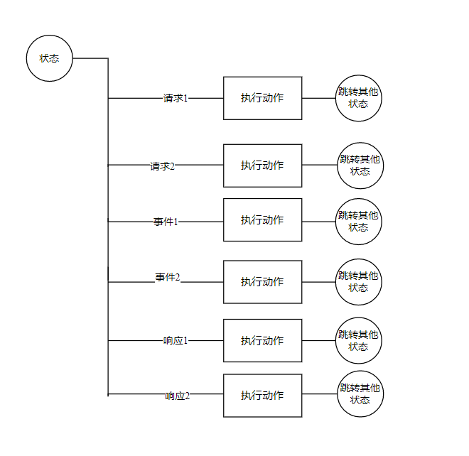

C++状态机设计

作者:祁伟

时间:2023年2月10日

# 前言：

使用C++语言实现一个状态机模型，状态机是树形结构，代码结构也需要用树形结构描述，状态机的代码结构既是执行逻辑，状态机的处理逻辑在代码结构中可以直观的展示出来。

# 专业术语：

## 状态机元素

**状态机：**在某种状态下满足某些触发条件可以处理一些动作然后改变状态的结构。

**状态：**状态机所处的场景，一个状态可以根据条件匹配请求、响应、事件，执行动作。然后进行状态转移

**当前状态：**状态机当前所处的状态，状态机在某一个时刻总是处于一个状态中。

**父状态：**在一个状态中可以嵌套其他的状态。此状态称为父状态，嵌入的状态为子状态。

**子状态：**一个状态可以嵌入到其他状态中，此状态相对于嵌入的状态是子状态

**动作：**可执行的代码块

**转移：**从当前状态到下一状态

**请求：**状态机对外提供的功能接口，由外部触发调用并等待返回结果，异步阻塞方式等待状态机处理结果。

**响应：**状态机对外发起的功能调用异步返回的结果，异步非阻塞方式交给状态机处理

**事件：**由外部在某些场景下产生的事件，异步非阻塞方式交给状态机处理。

**条件：**状态机匹配请求、响应、事件的规则

## 线程

**worker 线程：**状态机的任务执行线程，只有一个线程。状态机的所有逻辑都必需在此线程执行。

**定时器线程:** 产生定时任务的线程。

**任务线程：**在状态机中需要执行阻塞任务时，需要放到任务线程处理，任务线程处理完成后产生的响应再交由状态机处理。

**回调线程：**执行回调的线程

## C++语法：

**lamdba：**

**packaged_task：**

**future:**

**initializer_list：  
**

# 背景

## 背景

无

# 总体设计

## 设计原则

状态机执行是单线程，状态机中有一个worker线程，所有的的动作都是在worker线程中执行（请求处理、响应处理、事件处理）。worker线程中不能执行阻塞接口，如果调用的接口是阻塞的，需要放到任务线程中执行，等阻塞接口执行完毕后产生响应消息，放到状态机中执行。

状态机代码结构中专注状态处理，具体的功能实现代码放在状态代码中不合适，将功能设计为多个原子功能接口，实现中不包含业务逻辑。所有的原子接口由状态机发起调用，业务逻辑在状态机中处理。

## 设计的基本概念

基于状态控制，在当前状态下根据条件匹配收到任务（请求、事件、响应），匹配后后执行动作，然后跳转到其他状态。

### 状态机

用状态机来描述业务逻辑，每个状态机的状态是有限的，能从不同的状态之间转移，所以能实现无限个状态。状态机中包括状态、条件（请求、响应、事件）、动作、次态（下一状态）。状态结构图：

#### 单状态

#### 父子状态

#### 状态默认动作

### 核心结构

状态可以包含它的内部结构，一个状态元素可以嵌套状态元素，样的状态叫做组合状态并且称其为父状态，嵌套状态称其为子状态，这些子状态也可以有自己的嵌套并且可以嵌套任意深度。最终，我们会到达未包含任何子状态的状态。这样的状态成为原子状态。

组合状态影响到事件匹配的选择，当查找匹配元素时，状态机首先查找当前的活动状态，如果在当前状态中没有匹配，状态机会查找它的父状态，然后是父状态的父状态，以此类推。因此在祖先状态中的匹配事件将是子孙状态下没有匹配到事件的默认匹配。如果在任何状态下都没有配合，事件将被丢弃（可以在顶层状态中添加通配符匹配要丢弃的事件）。

当匹配上一个条件后

从当前状态可以跳转到任意目标状态。

#### 当前状态

现在所处的状态

#### 子状态

存在父状态的状态

#### 请求

通过外部API接口调用属于请求

#### 事件

有外部模块产生的事件输入通知，例如网络断开、被踢、房间解散

#### 响应

在状态机中调用外部模块接口，产生的回调属于通知

#### 条件

在匹配逻辑中除了事件名称，还可以进行其他的条件匹配。条件是一个bool 表达式，此表达式计算结果为true通过，false不通过

#### 执行动作

可执行的代码块，执行代码块时需要捕获异常，在代码块中有异常后不影响继续执行后面的代码块。

#### 状态进入

状态进入时执行的代码块

#### 状态离开

状态离开时执行的代码块

#### 定时器

状态机内部实现的定时器，在状态机执行不允许使用sleep，可以用内部定时器或者外部定时器代替

## 线程模型

所有的状态处理、任务发起调用在worker线程中执行，具体的任务在工作子线程执行(nodejs、libevent、libuv都是此线程模型）。在worker线程中不允许调用阻塞接口，如果有阻塞接口应该发起调用任务到子线程后返回继续处理后续流程，子线程执行完阻塞接口后返回结果到事件队列里，等待worker线程处理。

1.  外部发起API调用，生成一个task放到状态机任务队列中，并等待返回值
2.  worker_thread_从任务队列中取出一个任务，判断参数是否合法，当前状态是否可执行，返回值,成功:0，失败：错误码。
3.  worker_thread\_ 执行状态机里的代码块，发起阻塞调用，交由task_thread_执行。
4.  worker_thread_设置一个定时器收
5.  task_thread_执行阻塞接口完毕，产生一个response放到到状态机任务队列中。
6.  定时器触发，产生一个event放到状态机任务队列中。
7.  worker_thread_依次处理任务，产生一个回调，放到回调线程中。
8.  外部产生Event，放到状态机任务队列中。
9.  worker_thread\_ 处理Event,产生一个回调，放到回调线程中。

### worker状态线程

状态机处理线程，每个user一个，当前SDK只支持单用户实例，只需要一个。

### 任务子线程

阻塞任务不能在worker线程中执行，放到任务子线程中执行

### 回调线程

对外部的回调都有此线程触发，此线程被阻塞不影响SDK其他线程运行。

### 定时器线程

定时器线程

# 运行设计

# 实现方式

## 状态机

函数运行时绑定，函数参数先获取到进行保存，状态机执行时候找到状态下的合适函数进行绑定执行。
